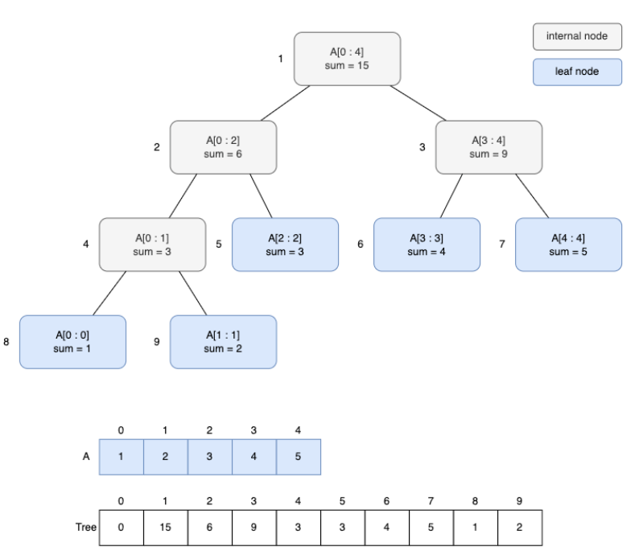
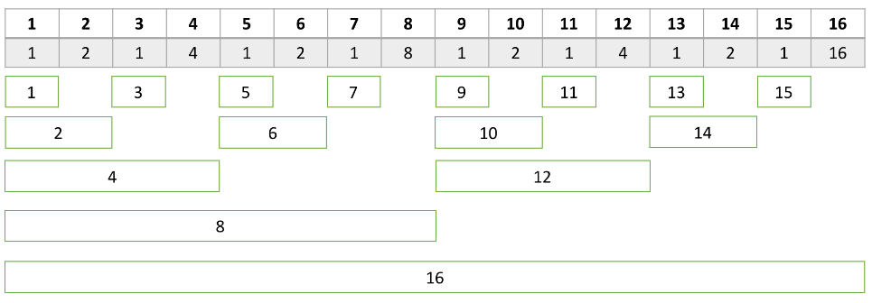
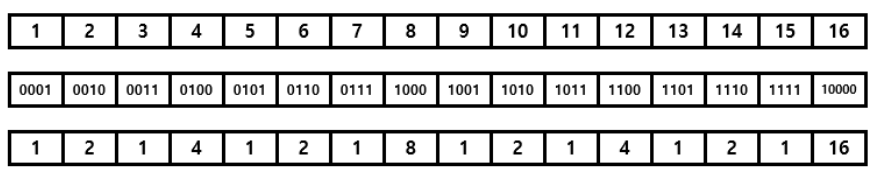
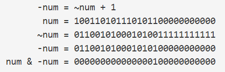
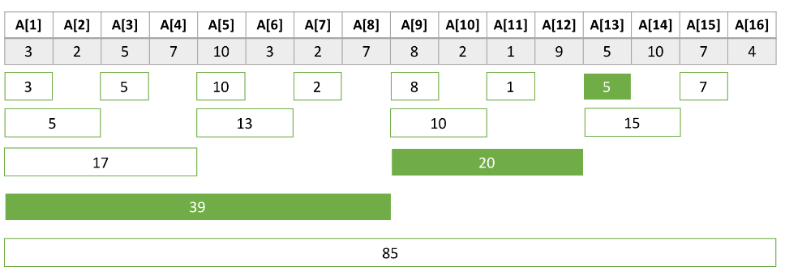
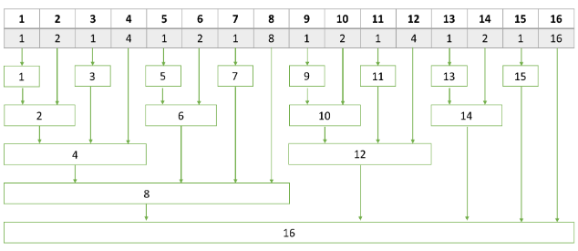
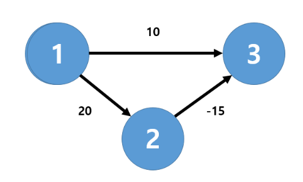

* 누적합 : 정적 배열
* 트리 : `동적 배열` + 카운티 (세그먼트 트리, 펜윅 트리, 카운팅 트리)


# 세그먼트 트리
#### 구간을 저장하기 위한 트리
세그먼트 트리는 `구간합을 저장하기 위한 트리`이다.

매번 구간합을 계산하는 경우의 시간복잡도는 
1. 특정 구간에 대한 합 : O(N)
2. 특정 값 수정 : O(1)

세그먼트 트리를 사용하게 되면 `O(logN)`의 시간으로 해결할 수 있다.


A = [1, 2, 3, 4, 5] 일 때 


크기가 N인 배열이 존재할 때
1. 트리의 높이 = `ceil(log2(N))`
2. 세그먼트 트리의 크기 = `(1 << (트리의 높이 + 1) )`

``` cpp
int height = ceil(log2(n));
int tsize = 1 << (height + 1);
```

## 구간 합
> 출처: https://eun-jeong.tistory.com/18 

* cur_node : 노드 번호
* start, end : 해당 노드가 담당하는 범위
* left, right : 합 구해야하는 구간

* `[left,right]`와 `[start,end]`가 겹치지 않는 경우 : 교집합이 공집합인 경우
* `[left,right]`가 `[start,end]`를 완전히 포함하는 경우 : 교집합이 [start, end]인 경우
* `[start,end]`가 `[left,right]`를 완전히 포함하는 경우 : 교집합이 [left, right]인 경우
* `[left,right]`와 `[start,end]`가 겹쳐져 있는 경우 (1, 2, 3 제외한 나머지 경우)

``` cpp

int sum(int cur_node, int start, int end, int left, int right){
    
    // 1. 범위 겹치지 않는 경우 (탐색 x)
    if(left > end || right < start) return 0; 

    /**
     * 2. cur_node가 담당하는 [start,end] 범위가
     *    합을 구해야하는 범위인 [left, right] 범위에 포함되는 경우
     * 
     * [start, end]가 [left, right] 범위에 포함되기 때문에 바로 반환
     * */ 
    if(left <= start && end <= right) return segmentTree[cur_node];

    // 3. 왼쪽 or 오른쪽 자식을 루트로 하는 트리에서 다시 탐색 
    int mid = (start + end) / 2;
    int left_sum = sum(cur_node*2, start, mid, left, right);
    int right_sum = sum(cur_node*2 + 1, mid+1, end, left, right);

    return left_sum + right_sum;
}
```
#### 시간 복잡도 : `O(logN)`


## 값 바꾸기
1. `[start, end]`에 idx가 포함되는 경우
2. `[start, end]`에 idx가 포함되지 않는 경우

idx번째 수를 val로 변경한다면 
* diff = val - arr[idx]

> 왜냐하면, 세그먼트 트리는 `구간에 따른 연산 결과를 저장해놓은 트리`이기 때문에, 특정 idx의 값이 바뀌게 되면 그 값이 영향을 미치는 상위 노드들의 값도 바뀌어야 하기 때문이다.

``` cpp
void update_segmentTree(int cur_node, int start, int end, int idx, int diff){
    // 범위 벗어남 
    if(idx < start || idx > end) return;

    // idx에 영향을 받은 노드들 
    segmentTree[cur_node] = segmentTree[cur_node] + diff;

    // 리프 노드가 아닌 경우 자식 노드들도 변경해주어야 함
    if(start != end){
        int mid = (start + end) / 2;
        update_segmentTree(cur_node*2, start, mid, idx, diff);
        update_segmentTree(cur_node*2 + 1, mid + 1, end, idx, diff);
    }
    
}
```


# 펜윅 트리
펜윅 트리는 세그먼트 트리보다 더 적은 메모리로 연산을 처리할 수 있다.
펜윅 트리는 배열의 크기 n 만큼으로만 설정한다.
펜윅 트리는 세그먼트 트리와 다르게 `누적합 (0 ~ k번 index까지의 합)`을 많이 이용한다.

* 세그먼트 트리 : `구간합`
* 펜윅 트리 : `누적합`



펜윅 트리는 `1이 존재하는 최하위 비트 값`을 이용해서 연산을 진행한다.

1. 펜윅트리는 `비트`를 이용해서 생성한다.
2. 각 idx를 2진수로 표현했을 때, `1`이 존재하는 최하위 비트 n을 찾는다.
3. 해당 idx로부터 `n칸 앞`까지의 구간연산에 대한 결과값을 찾는다.



## (Idx & -Idx)
최하위에 있는 1인 비트 위치


## tree[i]
L[i] : 마지막 1 위치
* L[1] : 1 (0001)
* L[4] : 4 (1000)
* L[10] : 2 (1010)

n개의 수를 arr[1] ~ arr[n] 이라고 할 때
tree[i] 는 arr[i] 부터 앞으로 L[i]개의 합이 저장되어 있다.
* tree[12] : arr[12]로부터 앞으로 L[12]만큼 앞에 저장되어 있다.
    = arr[9] + arr[10] + arr[11] + arr[12]
         
## Sum

tree를 이용해 arr[1] + ... + arr[13]을 구하는 방법
13 = 1101(2)
arr[1] + ... + arr[13] = tree[1101] + tree[1100] + tree[1000]
``` cpp
int sum (int idx){
    int ret = 0;
    while(idx > 0){
        ret += tree[idx];
        idx -= (idx & -idx);  
    }
}
```

## Update

`+`를 통해 담당하고 있는 모든 구간을 업데이트해주어야 한다.
``` cpp
void update(int idx, int diff){
    while(idx <= n){
        tree[idx] += diff;
        idx += (idx & -idx);
    }
}
```

# 최단거리
* bfs : 가중치가 같은 그래프 
* 최단거리 알고리즘 : 가중치가 다를 경우 
    * 다익스트라
    * 벨만 포드
    * 플로이드워셜 

## 1. 다익스트라 
`한 정점`에서 `다른 모든 정점`으로까지의 최단 경로를 구하는 알고리즘

다익스트라 알고리즘은 가중치가 `양수`일 때만 사용가능하다.

간선의 수를 E, 노드의 수를 V라고 할 때, 최소힙을 이용한 다익스트라 알고리즘의 시간 복잡도는 `O(ElogV)`가 된다.
* 하나의 

### 최소힙 
#### 1. -1 가중치를 넣는 방법 
``` cpp
priority_queue<pair<int,int>> pq1;

void dijkstra1(int start){

    dist[start] = 0; // 시작 노드 거리 0
    pq1.push({0,start}); // cost , node

    while(!pq1.empty()){

        int cur_cost = -pq1.top().first; // 최소힙으로 만들때 `-` 
        int cur_node = pq1.top().second;
        pq1.pop();

        // 마지막으로 갱신된 정점으로만 계산 진행
        if(dist[cur_node] != cur_cost) continue;

        for(int i = 0; i< graph[cur_node].size(); i++){
            int next_node = graph[cur_node][i].first;
            int next_cost = cur_cost + graph[cur_node][i].second;

            // cost 업데이트
            if(next_cost < dist[next_node]){
                dist[next_node] = next_cost;
                pq1.push({-next_cost, next_node});
            }
        }
    }

}
```

#### 2. greater
``` cpp
priority_queue<pair<int,int>, vector<pair<int,int>>, greater<pair<int,int>>> pq;

void go(int start){
    // 초기값 
    dist[start] = 0;
    pq.push({0,start});

    while(!pq.empty()){
        int cur_dist = pq.top().first;
        int cur_node = pq.top().second;
        pq.pop();

        if(dist[cur_node] != cur_dist) continue;

        for(int i = 0; i< graph[cur_node].size(); i++){
            int next_node = graph[cur_node][i].first;
            int next_dist = cur_dist + graph[cur_node][i].second;

            if(next_dist < dist[next_node]){
                pq.push({next_dist, next_node});
                dist[next_node] = next_dist;
            }
        }
    }

}
```

## 2. 플로이드 워셜
다익스트라 알고리즘이 `출발지 정점` 1개를 정해 놓고 `다른 모든 정점`으로의 최단 경로 였다면

플로이드 워셜 알고리즘은 `모든 정점`에서 `모든 정점`으로의 최단 경로를 구하는 것이다.

#### 점화식
``` cpp
distance[i,j] = min(distance[i,j], distance[i,k] + distance[k,j]);
```

#### 시간 복잡도 : O(N^3)

``` cpp
    for (int k = 1; k <= n; k++) {
        for (int i = 1; i <= n; i++) {
            for (int j = 1; j <= n; j++) {
                dist[i][j] = min(dist[i][j], dist[i][k] + dist[k][j]);
            }
        }
    }
```

## 3. 벨만 포드


1. 다익스트라 알고리즘 
    * 매번 `방문하지 않은` 노드 중에서 최단거리가 가장 짧은 노드를 선택
    * 움수 간선이 존재하면 최단 거리를 찾을 수 없는 상황 발생 

2. 벨만 포드 알고리즘
    * 매번 `모든 간선` 확인하면서 모든 노드간의 최단 거리를 구해간다.
    * 음수 간선이 있어도 최적의 해를 찾을 수 있다.

모든 간선의 비용이 양수일 때는 다익스트라를, 음수 간선이 포함되어 있으면 벨만 포드를 사용하면 된다.

### 라운드
n개의 정점이 있을 때, n-1번의 라운드를 진행해야한다.
* 1 → 2 간선 2번 정점이 계산 (2번 정점 계산됨)
* 2 → 3 간선 3번 정점이 계산 (3번 정점 계산됨)
* 3 → 4 간선 4번 정점이 계산 (4번 정점 계산됨)

### 구현
모든 간선을 탐색하면서, 간선이 잇는 출발 정점이 `한번이라도 계산된 정점`이라면 해당 간선이 잇는 정점의 거리를 비교해서 업데이트

#### 한번이라도 계산된 정점일 때만, 해당 간선에 의한 최신화 진행
* 실제로 접근 가능한 경로인지 확인하는 용도

벨만포드 알고리즘은 `최소 비용`을 구하는 알고리즘이 아니라, `음의 사이클`이 발생해서 `최소 비용`을 제대로 계산할 수 없다 라고 만들어주는 알고리즘

``` cpp
struct edge{
    ll from, to, cost;
};

// n-1 번 라운드
for (int j = 0; j < n; j++) {  

        // 모든 간선 탐색
        for(edge cur : arr){
            from = cur.from;
            to = cur.to;
            cost = cur.cost;

            if(dist[from] == INF) continue;
            if(dist[to] > dist[from] + cost){
                dist[to] = dist[from] + cost;
            }
        }
    }
```
### `음의 사이클`이 존재하는 것을 판단하는 방법
* n-1번 모든 간선을 탐색
* 한번 더 모든 간선을 탐색

`한번 더 탐색`하는 과정에서 최소 비용이 변하는 정점이 있을 것

``` cpp
for(edge cur : arr){
    from = cur.from;
    to = cur.to;
    cost = cur.cost;

    if(dist[from] == INF) continue;
    if(dist[to] > dist[from] + cost){
        cout << -1 << endl;
        return 0;
    }

}
```

## 알고리즘 분류
#### 1. 다익스트라
* 시작점부터 끝점까지 : N의 크기가 큼
* 음의 가중치를 가지지 않은 문제

#### 플로이드
* 모든 정점의 쌍의 거리를 구해야 하는 문제
* N의 크기가 작음. (보통 400이하입니다.)

#### 벨만포드 
음의 가중치를 가진 그래프가 있는 문제
