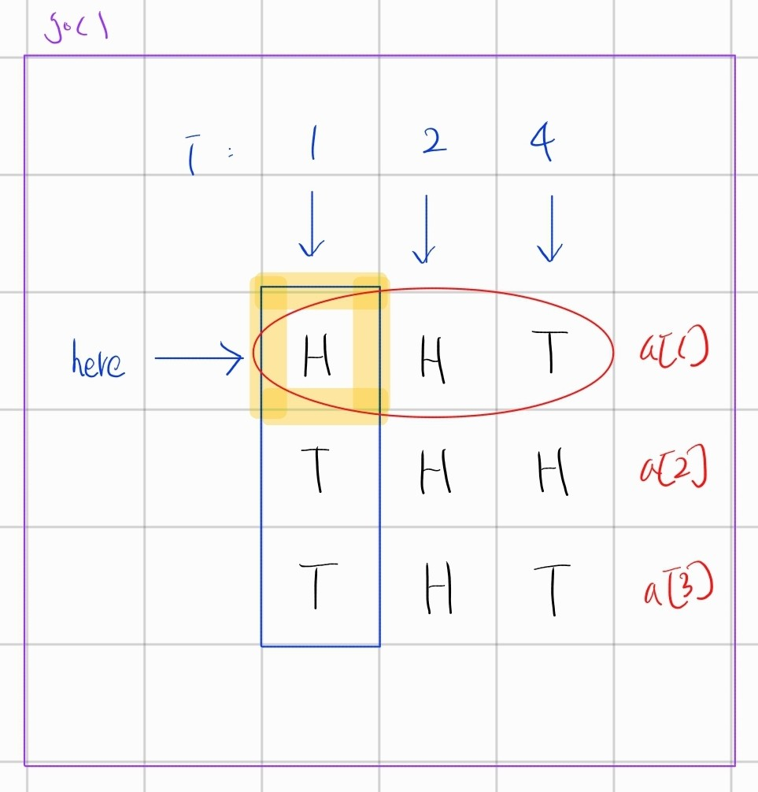
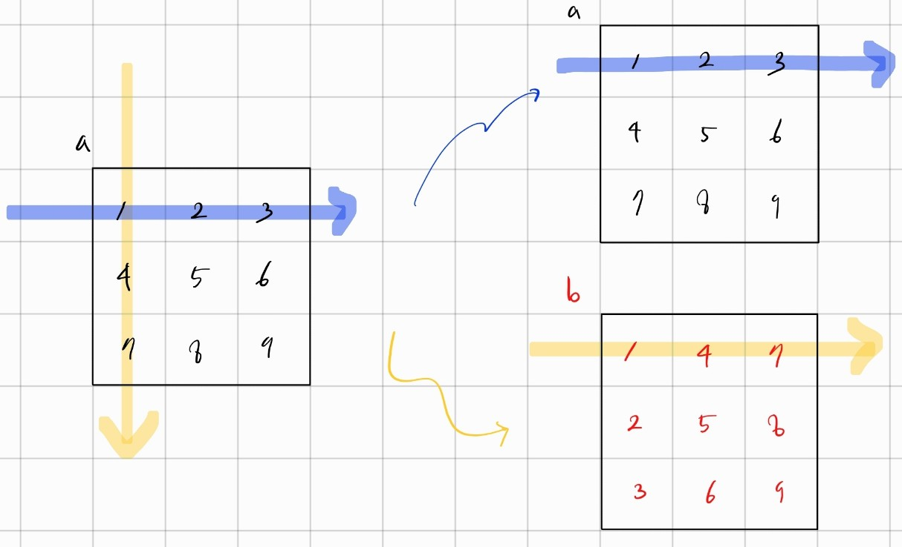

# 4-A 19942
## struct
* 2개 받을 때 pair
* 3개 받을 때 triple
여러가지 받을때는 구조체로 나타낼 수 있다.

``` cpp
struct A{
    int mp,mf,ms,mv,cost;
};

// 구조체 배열 
A adj[16];

// 입력 받기 
for(int i = 0; i < n; i++){
   cin >> adj[i].p >> adj[i].f >> adj[i].s >> adj[i].v >> adj[i].cost;  
}
```

## 비트로 경우 판단하기
n 개의 선택지가 있을때
n개로 만들 수 있는 모든 경우의 수는 `1<<n -1 ` 개이다.
```
1 10 11 100 101 111 ~ (1<<n -1)

```

`bit를 이용하면 n개중 몇개의 요소들로 이루어져 있는지 확인`할 수 있다.
* 2개 : 000011, 000101
* 3개 : 000111, 101010
* 4개 : 110011, 101011

vector 를 하나 생성해서 포함하는 선택지의 번호를 넣을 수 있다.

``` cpp
for(int i = 1; i<(1<<n); i++){    // 모든 경우의 수 
    vector<int> v
    for(int j = 0; j<n ; j++){
        if(i & (1<<j)){           // 특정 자리수가 해당될 때
            v.push_back(j+1);
        }
    }
}
```

# 4-B
문제 처음 시간복잡도를 계산해볼 때 `2^40` 이 나와 1억이 넘어가므로 쉽게 생각하는 방법이 필요함.

* `열 / 행` 1줄만 미리 바꾸고, 다른 줄은 `T 개수가 H 개수보다 많을 때만 반전시킨다.`

## 문자를 bit를 이용해 숫자로 바꾼다.
HHT = 4 ( 0 0 1 ) 
THH = 1 ( 1 0 0 )
THT = 5 ( 1 0 1 )

``` cpp
for(int i = 1; i <= n ; i++){
    int value = 1;
    for(int j = 0; j < s.size(); j++){
        if(s[j] == 'T') {
            a[i] |= value;      // value(bit)를 이용해 문자열을 숫자로 바꾼다.
        }
    }

    value *= 2;  
}
```

## (행 선택) 각 행을 반전시킨다 + 재귀 사용 
#### `a[here] = ~ a[here]`
* HHT : 4 (001) -> (110)
* THH : 1 (100) -> (011)
* THT : 5 (101) -> (010)

``` cpp
void go(int here){
    if( here == n+1){}

    go(here + 1);           // 행 반전시키지 않는 경우

    a[here] = ~ a[here];
    go(here + 1);           // 행 반전시키는 경우
}
```

## 새로줄에 T의 개수를 찾는다.


``` cpp
int sum = 0;
for(int i = 1; i <= (1 << (n-1)); i *= 2){  // 열 1 2 4 8 로 표현
    int cnt = 0;
    for(int j = 1; j <= n; j++){ // 행
                                 // a[j] : 행 전체 의미
        if(i & a[j]){            // i & a[j] : 행 & 열 통해서 한칸 T(양수) 찾기
            cnt++;
        }
    }
}
```

# 4-C 17471
* 영역을 구분할때 무조건 특정 영역개수 (`2,3,4`)로 나누려고 하지않아도 되었음. 나중에 조건을 통해 `결과값 = n`으로 `2가지` 영역으로 나눌 수 있었다.

* `ret = 1` 로 설정해두고 재귀할 때 더하는 방식 기억좀...

#### 1. 전체 경우의 수
``` cpp
  for(int i = 1; i< (1 << n) - 1; i++){
     
  }
```

#### 2. 2개의 영역인지 구별
인접한 영역을 구하는 법이 어려웠다.

1. `comp`란 배열에 `영역1 : 1`, 이외의 영역은 `0`으로 표시한다.
``` cpp
for(int j = 0; j < n; j++){
        if(i & (1<< j)){
            comp[j+1] = 1;
        }else{ }

     }
```

2. 영역 별로 개수를 센다

dfs 반환값 `pair, int 등등` 생각해볼 것 
``` cpp
pair<int,int> compa =dfs(cidx,1);
pair<int,int> outa = dfs(oidx,0);

pair<int,int> dfs(int here, int area){
    visited[here] = 1;
    pair<int,int> ret = {1,people[here]}; // 초기값 ,
    for(int next : graph[start]){
        if(visited[next]) continue;
        if(comp[next] != area) continue;  // area 영역에 포함되지 않을때
        pair<int,int> temp = dfs(next, area);  
        ret.first += temp.first;
        ret.second += temp.second;
    }
    return ret;
}
```

3. 2가지 영역으로 나누어질 때는 영역 개수의 합이 `n`이고, 그렇지 않으면 `n이하`이다.
``` cpp
if(compa.first + outa.first == n){
    // 
}
```

#### 3. 개수 

# 1987

## 방문 처리 방법
#### 1. visited
#### 2. bit 
* 현재 방문 상태 : num
* 다음에 방문할 위치 : _next
* 이전에 방문했는지 확인 : num & _next
* 방문 표시 : num | _next

``` cpp
go(1,1, 1 << (int)(graph[1][1] - 'A'),1);  // 

void go(int cr, int cc, int num ,int cnt){

    ret = max(ret,cnt);
    
    for(int i = 0; i<4; i++){
        int nr = cr + dr[i];
        int nc = cc + dc[i];

        if(nr<1 || nr > r || nc <1  || nc > c) continue;
        int _next = (1 << (int)(graph[nr][nc]-'A'));

        if( (num & _next ) == 0){ // 
            go(nr,nc, num | _next , cnt + 1);
        }
    }
}
```

# 4-E 14890

## 1. 그래프 (이차원 배열) 대칭



## 2. cnt 변수 1개 이용하는 로직 


`l = 3` 일 때
* 3 2 2 2 1
    * `3 -> 2` 만날 때 `cnt >= 0` 이어야 경사로 놓을 수 있고
        * `cnt = -l + 1` 로 초기화 
    * `2 -> 1` 만날 때 `cnt >= 0` 이어야 경사로 놓을 수 있고
        * `cnt = -1 + 1`로 초기화

* 2 2 2 3
    * `2 -> 3` 만날 때 `cnt >= l` 이어야 하고 경사로 놓을 수 있다.
    * `cnt = 1` 로 초기화 

## 3. c 보충

#### 함수에 배열을 매개변수로 전달할 때
``` cpp
// 2차원 배열 
void func (int (*arr)[104]){}
void func (int arr[104][104]){}

// 1차원 배열 
void func(int arr[104]){}
void func(int * arr){}
```

* for 문 
``` cpp
int c;
for(c = 0; c < 10 ; c++){
    // inner c = 0 1 2 3 4 5 6 7 8 9 10
}

// outer c = 10
// 마지막 for문에서 c = 9 이고 밖으로 나오면서 c++을 실행하고
```

# 4-F 1062

## 문자열 -> 문자 -> 알파벳 비트로 포함 표현
알파벳 a, b, c, d, e, f ... 를 표현하는 방법은 주로 `배열`or `2진법`으로 표현하는 듯 
* 배열 : int alpha[26]
* 2진법 : (a:1), (b:2), (c:4), (d:8) .... 

## 문자열 -> 비트 -> 숫자로 표현
``` cpp
words[i] // i 번째 문자열

string stri ="antic"
for(char ch : stri){
    words[i] |= ( 1 << (ch - 'a'));
}
```

## 
* {a n t i c}인 경우 : 무조건 배워야 함
* {a n t i c}아닌 경우 : 배우거나 배우지 않거나 
``` cpp
// index : 알파벳 위치
// k : 배울 수 있는 단어 개수 
// mask : 배운 단어 비트로 표현 ( |= )
int go(int index, int k, int mask){                      

    if(k <0) return 0;

    if (index == 26) return count(mask);                // 모든 알파벳을 탐색했다.

    int ret = go(index + 1, k-1, mask | (1 << index));  // index 위치의 알파벳을 배우고 다음 단계                            

    if (index != 'a'-'a' && index != 'n'-'a' && index != 't'-'a' && index != 'i'-'a' && index != 'c'-'a') {  
        // a n t i c 위치가 아닌 경우에는 안배울 수도 있음 
        ret = max(ret, go(index+1, k, mask));
    }

    return ret;
}
```

# 4-G 1094
## 1. 진법
```cpp
//
int n = 100;
int b = 2;
while(n > 1){
    v.push_back(n % b);
    n /= b;
}
if(n == 1) v.push_back(1);
reverse(v.begin(), v.end());

```

## 2. 2진법 1 개수 세기
```cpp
while(n != 1){  
        if(n & 1) ret ++;   // 마지막 비트가 1일때 = 홀 수 일때
        n /= 2;
    }
```


# 4-H 2234

## DFS 재귀 암기좀 !!!

``` cpp
int dfs(int cr, int cc, int cnt){  // cnt : 영역을 의미함

    if( visited[cr][cc]) return 0; // 방문시 ret += 0 이 되어야 하므로

    int ret = 1;
    int visited[cr][cc] = 1

    for(int i = 0; i< ; i++){

        int nr = cr + dr[i];
        int nc = cc + dc[i];
        ret += dfs(nr,nc, cnt);
    }
}
```

# 4-J 14391

## 방식 1. 1차원으로 풀이
### 2차원 배열 → 1차원으로 편다
`(1 << (n*m))` 에 2차원 배열이 `0`, `1`로 표현되는 모든 경우의 수 존재

``` cpp
for(int s = 0; s < (1 << (n*m)); s++){

}
```

### 1차원으로 행/열 표시
* i : 행
* m : 열 개수
* j : 현재 열 변호 

2차원 a[2][2] 를 1차원 a[`2*m + 2`] 로 표현할 수 있다.

``` cpp
for (int i = 0; i < n; i++) {
    for (int j = 0; j < m; j++) {
        int k = i * m + j;
        if ((s & (1 << k)) == 0) {} // 특정 s 경우에 k번째 위치 확인
    }
}
```

## 방식 2. 2차원으로 풀이
### 재귀
visited[] 배열을 통해서 가로 줄 모든 경우 파악 
``` cpp
int visited[5];  // row 가 표시될 수 있는 

void go(int depth) {                      // row 
    if (depth == n) {
        ret = max(ret, count());
        return;
    }

    for (int c = 0; c < (1 << m); c++) {  // col
        visited[depth] = c;               // 가로로 지나는 점 check
        go(depth + 1);
    }
}
```

# 4-K 13244

## 트리성질
1. 노드가 `N개`인 트리는 항상 `N-1개`의 에지(간선)을 가진다.

## 2차원 배열
``` cpp
vector<int> adj[1004];

// 초기화
for(int i = 1; i<1004; i++) adj[i].clear();

// find
if(find(adj[i].begin(), adj[i].end(),value) == adj[i].end()) // value가 없음
```

# 4-J 5430
## reverse(begin(),end())
STL의 reverse 시간복잡도 `O(N)` 
10만개의 `RRR`이 있으면 reverse 10만번 해야하는 것

이 문제에서 핵심은 `bool rev` flag 와 deque 를 이용해서 `실제 reverse 횟수를 줄이는 것`이다.

``` cpp
bool rev = false;
for(char ch : string p){
    if(ch == 'R') { // reverse 표시
        rev = != rev;
    }else {         // delete
        if(rev) deque.pop_back();
        else deque.pop_front() 
    }
}
```
 

## deque
reverse(dq.begin(), dq.end()) 가능 → iterator들은 모두 가능하다.
``` cpp
deque<int> dq;
// push
dq.push_front(1);
dq.push_back(2);

// pop
dq.pop_back();
dq.pop_front();

dq.size() 

reverse(deq.begin(), deq.end())
```
## 문자열 분리 부분
입력 : [1,2,3,4] -> 1 2 3 4 로 분리
### 숫자 + for
``` cpp
int x = 0;
for(char c : string order){
    if(c == ']' || c == '[') continue;
    else if(c >= '0' && c <='9'){ // 숫자라면 

    }else{                        // , 일때
        if(x > 0) deque.push_back(x); 
        x = 0;
    }
}
```

### split (빠른)
인덱스 start, end 이용해서 원하는 iterator 형태로 만듬
``` cpp
deque<string> split(string input, string delimiter){
    deque<string> dq;
    auto start = 0;
    auto end = input.find(delimiter); // 초기 위치

    while(end != string::npos){ // 
        dq.push_back(input.substr(start, end - start));
        start = end + deliter.size();
        end = input.find(delimiter, start);
    }
    dq.push_back(input.substr(start));
    return dq;
}
```

# 4-M 14405
* char 배열 : strcmp(s1, s2)
    * 0 보다 작을 때 s1 이 s2 보다 사전적으로 앞에 있다.
    * 0 보다 클 때 s1이 s2 보다 사전적으로 뒤에 있다.

* string : compare

* `==` 연산자 오버로딩
    c++ 에서만 가능


## substr
`string.substr(startidx, require_size)`
substr를 사용하기 전에 필요한 만큼의 size가 있는지 먼저 확인해야 한다.

``` cpp
for(int i = 0; i < s.size(); i++){
		if(i < s.size() - 1 && s.substr(i, 2) == "pi" || s.substr(i, 2) == "ka") i += 1; 
		else if(i < s.size() - 2 && s.substr(i, 3) == "chu") i += 2; 
}
```