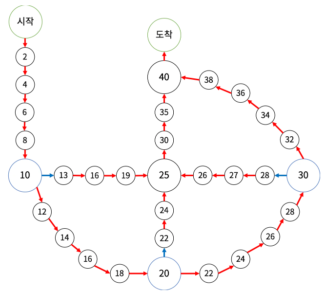

# 그리디는 sort + pq

# 5-A 2109

## 1. 구조체 정렬 
구조체를 pq에 넣을때 `operator<`을 구현한다.
priority_queue는 max_heap이 기본
operator< 이 `return true` 되는 조건일 때 위로 오게 된다.

Ob 객체
1. d는 오름차순
2. p는 내림차순

``` cpp
struct Ob{
    int d;
    int p;

    Ob(int _d, int _p): d(_d), p(_p){}

    bool operator<(const Ob& ob) const{
        if(d != ob.d){
            return d > ob.d;   // 나중에 들어온 d 값이 작을 때 위로 
        }else{
            return p < ob.p;  // 나중에 들어온 p값이 더 클 때?
        }
    }
};

priority_queue<Ob> pq;
pq.push(Ob(d,p)); // push할 때는 생성자로 넣는다.

// 1 20
// 1 2
// 2 100
// 2 8
// 3 10
// 10 50
// 20 5
```
#### [문제해설]
```cpp
for(int i = 0; i< n; i++){ 
    pq.push(v[i].second);       // 현재 날짜에서 가능한 강의

    if(pq.size() > v[i].first){ // v[i].first(일) 까지 하루에 1개씩
        pq.pop();               // 가장 pay가 큰 v[i].first (개)
    }
}
```

# 5-B 9935

## 시간복잡도 줄이는 방법 ( 입력하면서 + @ 과정 진행)
* 입력
* 특정 조건 만족시 삭제

입력을 하면서 삭제를 하기 때문에 `O(N)`의 시간복잡도가 나온다...
```cpp 
for (char in : a) { 
        st.push(in);

        if (st.size() >= sz && st.top() == b[sz - 1]) {
            string temp = "";
            for (int i = 0; i < sz; i++) {
                temp += st.top();
                st.pop();
            }

            reverse(temp.begin(), temp.end());

            if (temp != b) {
                for (auto a : temp) st.push(a);
            }
        }
    }

```

# 5-C

2109랑 비슷함
`최대`를 구하는 것 `최소를 ↑` 
* Min_Heap의 최소를 크게 만든다.

``` cpp
vector<pair<int, int>> vp;
priority_queue<int, greater<int>> pq; 

if (pq.size() > vp[i].first) {
    pq.pop();
}

```

# 5-E 1931
* 라인스위핑
* 그리디

## 구간 나오면 `정렬` 생각 

# 5-G 1644

## 소수 구하기1 - 에라토스테네스의 체 ( 필수로 암기 !!! )
* 2의 배수 제거
* 3의 배수 제거
* 4의 배수 제거 
* ...
* ...

#### 1000만 이하 까지
```cpp
vector<bool> isPrime(n+1,1);

for(int i = 2; i * i <= n; i++){         // n+1 요소 1로 채움
    if(isPrime[i] == 0) continue;        // i가 n의 제곱근까지 증가
    for(int j = i * 2; j <= n; j += i){  // i*2 부터 i의 배수들은 소수가 아님
        isPrime[i] = 0;
    }
}
```

## 소수 구하기 2 - 일일히 판별하는 함수
``` cpp
bool isPrime(int n){
    if(n <= 1) return 0;
    if(n == 2) return 1;
    if(n % 2 == 0) return 0;
    for(int i = 3; i * i <= n; i++){
        if( n % i == 0 ) return 0;
    }
    
    return 1;
}
```

## 투포인터
https://chanho0912.tistory.com/29?category=871243

* 구간 [start, end] 합 
* start, end 포인터가 최대 `N`까지 증가할 수 있음


# 5-k 17144

## 시계 방향, 반시계 방향 이동 

``` cpp
// 시계 방향
int dr2[] = {0, 1, 0, -1};
int dc2[] = {1, 0, -1, 0};

// 반시계 방향
int dr1[] = {0, -1, 0, 1};
int dc1[] = {1, 0, -1, 0};


vector<pair<int, int>> air(int airr, int airc, int dr[], int dc[]) {
    vector<pair<int,int>> v;

    return v;
}

// 1. 반시계 방향으로 확인 
vector<pair<int,int>> up = air(sr, sc, dr1, dc1);

// 2. 시계 방향으로 확인 
vector<pair<int,int>> down = air(sr, sc, dr2, dc2);

```

## 회전
방향만 정해진다면 

``` cpp
void rotate(vector<pair<int,int>> &v){ 
    
    for(int i = v.size()-1; i>0; i--){
        graph[v[i].first][v[i].second] = graph[v[i-1].first][v[i-1].second];
    }

    // 한칸씩 땡기기
    graph[v[0].first][v[0].second] = 0; 
}
```

# 5-L 14889

## 집합 나누기

집합 나누는 것은 `1` 과 `0` 으로 분리하는 것이 편하다
1 1 1 0 0 0 
1 0 1 0 1 0
1 1 0 0 0 1

#### 비트마스킹 
* __builtin_popcount(i) : i 2진수로 표현 후 1 개수 세는 것

``` cpp
for(int i = 0; i < ( 1 << n); i++){
    if(__builtin_popcount(i) != n/2) continue;

    vector<int> team1, team2;
    for(int j = 0; j < n; j++){
        if(i & (1 << j)) team1.push_back(j);
        else team2.push_back(j);
    }

}
```

## 백 트래킹 + 배열 
``` cpp
int visited[24];

void makeTeam(int start, int depth) {

    if(depth == n / 2){
        vector<int> team1, team2;

        for(int i = 0; i < n; i++){
            if(visited[i]) team1.push_back(i);
            else team2.push_back(i);
        }
    }

    for(int i = start; i < n ; i++){
        visited[i] = true;
        makeTeam(i + 1, depth + 1);
        visited[i] = false;
    }

}
```

# 5-M 12100

## 복사 
#### memcpy
배열만 사용가능 

``` cpp
// 1. a -> temp 로 복사
memcpy(temp, a, sizeof(a));

// 2. temp -> a 로 복사
memcpy(a, temp, sizeof(temp));
```
#### copy 
배열, vector 모두 사용가능 

``` cpp
// Array
int from[n] = {1,2,3};
int to[n];
copy(from, from + n, to);

int from[10][10];
int to[10][10];
copy(&from[0][0], &from[0][0] + 10*10, &to[0][0])

// vector
copy(from.begin(), from.end(), to.begin())
```

## 함수 배열 매개변수 
#### 2차원 배열  

``` cpp
void m1(int arr[][3]){}

void m2(int arr[3][3]){}

// call-by-reference를 기준으로 한다.
void m3(int (*arr)[3]){}
```
# 5-O 17406

## 1. 순열 
1. 123
2. 132
3. 213
4. 231
5. 312
6. 321

1. next_permutaion
```cpp
vector<int> v_idx;
for(int i = 0; i< n; i++){
    v_idx.push_back(i);
}

do{
    memcpy(temp, graph, sizeof(graph));
    
    // 1 2 3 
    for(int i : v_idx){ 

    }

} while(next_permutaion(v_idx.begin(), v_idx.end()));
```

do-while 한 사이클이 1, 2, 3, 4, 5, 6 번 경우이기 때문에 memcpy으로 초기화 해주어야 함.

## 2. 회전 

### 그래프로 회전 시키기 
덮어 씌울때는 뒷 부분부터 당기는 것이 낫다.

```cpp
void go(int arr[54][54], int r, int c, int s) {
    for (int i = 1; i <= s; i++) {
        int top = r - i, bottom = r + i, left = c - i, right = c + i;

        // 
        int tmp = arr[top][left];

        // 왼쪽
        for (int j = top; j < bottom; j++) {
            arr[j][left] = arr[j + 1][left];
        }

        // 아래쪽
        for (int j = left; j < right; j++) {
            arr[bottom][j] = arr[bottom][j + 1];
        }

        // 오른쪽
        for (int j = bottom; j > top; j--) {
            arr[j][right] = arr[j - 1][right];
        }

        // 위쪽
        for (int j = right; j > left; j--) {
            arr[top][j] = arr[top][j - 1];
        }

        arr[top][left + 1] = tmp;
    }
}

```

### 시계방향 : rotate(rbegin(), rbegin()+1, rend())
2차원 배열자체에서 회전시키는 방법은 없다.

1. rotate를 시킬 점들을 뽑는다.
```cpp
vector<int> vvv;       // 배열 값 저장
for(pair<int, int> c : vv){
    vvv.push_back(graph[c.first][c.second]);
}
```

2. rotate 시킨다.
```cpp
rotate(vvv.rbegin(),vvv.rbegin()+1,vvv.rend());
```

3. 다시 graph에 붙여넣는다.
```cpp
for(int i = 0; i < vv.size(); i++){
    graph[vv[i].first][vv[i].second] = vvv[i];
}
```

# 5-P 15662

## 배열 초기화 
* memset 
-1, 0으로만 초기화
```cpp
const int max_n = 1004;
int a[max_n];
int b[max_n][max_n];

memset(a, -1, sizeof(a));
memset(b, 0, sizeof(b));
```

* fill
전체 배열을 모든 값으로 초기화 
```cpp
int a[10];
int b[10][10];

fill(a, a+10, 100);
fill(&a[0],&a[0]+10, 100);
fill(&b[0],&b[0]+10*10, 100);
```

# 5-T 17143
## 좌표 이동 (모듈러 연산 )
graph[R][C] 이고, 왕복으로 이동 가능하다고 할 때
현재 위치 (r,c)에서 n 칸 좌표 이동한다고 할때, 반복문 n번 반복하면 `시간 초과`가 날 확률이 높음 
왕복으로 이동한다고 했으므로, 현재 위치로 부터 `최종적으로` 얼만큼 이동했는지를 직접 확인해야하고, 이를 모듈러 연산으로 구했다.
* n %= 2( R-1 )
* n %= 2( C-1 )

## XOR
* 0 → 1 → 0 → 1
* 2 → 3 → 2 → 3

0 `^=` 1 → `1` 
1 `^=` 1 → `0`
2 `^=` 1 → `3`
3 `^=` 1 → `2`


# 5-R 17825

## 그래프 표현

### 인덱스 그래프 


``` cpp
vector<int> index_map[54];
void add(int curIdx, int nextIdx) {
    index_map[curIdx].push_back(nextIdx);
}

// 1. 바깥족을 [0] 위치에 넣는다
for (int i = 0; i <= 19; i++) add(i, i + 1);  // i+1로 수정

// 2. 2점으로 들어갈 수 있는 것들은 [1]에 넣어진다.
add(5, 21);
add(21, 22);
add(22, 23);
add(23, 24);
add(15, 29);
add(29, 30);
add(30, 31);
add(31, 24);
add(10, 27);
add(27, 28);
add(28, 24);
add(24, 25);
add(25, 26);
add(26, 20);
add(20, 100);
```

### 값을 나타내는 그래프 


``` cpp
int val[104];

val[1] = 2;
val[2] = 4;
val[3] = 6;
val[4] = 8;
val[5] = 10;
val[6] = 12;
val[7] = 14;
val[8] = 16;
val[9] = 18;
val[10] = 20;
val[11] = 22;
val[12] = 24;
val[13] = 26;
val[14] = 28;
val[15] = 30;
val[16] = 32;
val[17] = 34;
val[18] = 36;
val[19] = 38;
val[20] = 40;
val[21] = 13;
val[22] = 16;
val[23] = 19;
val[24] = 25;
val[27] = 22;
val[28] = 24;
val[25] = 30;
val[26] = 35;
val[29] = 28;
val[30] = 27;
val[31] = 26;
```

## 완전 탐색, 백트래킹 
``` cpp
int go(int depth){
    
    // ...
    // ...
    for(int i = 0; i< 4; i++){
    
        mal[i] = moved_mal_idx;
        ret = max(ret, go(depth+1) + val[moved_mal_idx]);
        mal[i] = mal_cur_idx;

    }

    return ret;
}
```