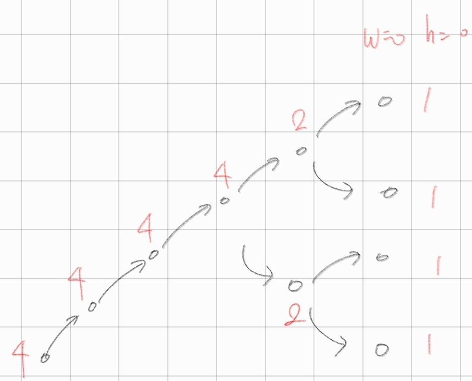

# 7-A 2098
val[cur][next] : cur점 → next 점으로 가는 비용
dp[cur][visited] : 현재 cur점에 있고, 지금까지 visited (방문 점들) 상태일 때의 최소 값

#### 범위 이외의 값 초기화
val이 양수의 값을 가지므로, 범위 밖의 값인 -1로 초기화
``` cpp
memset(dp, -1, sizeof(dp));
```

#### 메모제이션 
움직이는 방법의 수는 16! 까지 나올 수도 있다.
값이 너무 크므로 메모제이션 ( 상태 저장 )을 생각한다.

```
0 → 1 → 2 → 3 → 0
0 → 1 → 3 → 2 → 0  
```

#### 비트마스킹
16자리 수들을 방문처리 표시하기 위해서 비트마스킹을 사용한다.
* 00001001 : 3번, 0번 방문
* 00001011 : 3번, 1번 0번 방문
* 00011011 : 4번, 3번, 1번, 0번 방문


#### 재귀
현재 `dfs(cur, visited)` 상태에서 방문하지 않은 점으로 이동할 때
``` cpp
dfs(int cur, int visited){
    for (int next = 0; next < n; next++) {
        // 이미 방문 
        if (visited & (1 << next)) continue;

        // 지날 수 없는 점 
        if (val[cur][next] == 0) continue;

        // next 점 방문처리 
        dfs(next, (1<<next) | visited ); 

    }
}
```
최솟값을 구하는 과정은 재귀 return을 통해서 값을 더하는 과정을 통해서 dfs(0, 1)의 최솟값을 구하면 된다.

# 7-B 17070
dp[r][c][dir] : `dir 모양`인 r, c에 위치하는 파이프

``` cpp
// 파이프 오른쪽 : [0] 
dp[i][j+1][0] = dp[i][j][0];
dp[i + 1][j + 1][2] += dp[i][j][0];

// 파이프 아래쪽 : [1]
dp[i+1][j][1] = dp[i][j][1];
dp[i+1][j+1][2] = dp[i][j][1];

// 파이프 오른_대각쪽 : [2]
dp[i][j+1][0] = dp[i][j][2];
dp[i+1][j][1] = dp[i][j][2];
dp[i+1][j+1][2] = dp[i][j][2];
```
# 7-C 1103

## 메모제이션
``` cpp
int& ret = dp[cr][cc];
if(ret) return ret;   // << 저장된 특정 조건 확인
```

# 7-D 2240 
1. 완전 탐색 ?
2. 경우가 큰가 ? → 2^30 승 (X)
3. 메모제이션? → `상태를 저장해야 한다` (X)

## 3차원 DP...
상태를 가져야 한다는 것을 인지

1. 시간 t
2. 자두 위치 pos
3. 이동 횟수 mcnt

dp[t][pos][mcnt] 

## 재귀 방식 

#### 1. 점화식 
``` cpp
// 1. 이동 o
go(t + 1, pos^1, m-1);

// 2. 이동 x
go(t + 1, pos, m);
```
#### 2. 재귀
``` cpp
go(int t, int pos, int mcnt){
    if(t == n) return 0; // << t = n일 때 부터 t = 0 일 때까지 +1씩 해서 올라와야 한다/

    int not_move = go(t+1, pos^1, mcnt -1);
    int move = go(t+1, pos, mcnt);

    ret = max(not_move, move) + ( pos == brr[t] - 1);
}
```

# 7-E 4811



알약을 모두 다먹은 경우 1을 반환하도록 하여 재귀로 더한다.

```cpp
// 1. 알약 1개 먹을 때
dfs(w-1, h+1);

// 2. 알약 반개 먹을 때
dfs(w, h-1);

/**
 * 1개 짜리 알약 w개
 * 반개 짜리 알약 h개 
*/
dp[w][h] = dfs(w-1, h+1) + dfs(w, h-1);
```

# 7-F 12852
## 최적해 
부분 최적 구조 : 9 → 3 → 1 

## trace 
dp[1] = 0
dp[3] = 1
dp[9] = 2

#### 재귀 
``` cpp
void go (int cur){
    if(cur == 0) return ;
    cout << cur << '\n'

    if (cur % 3 == 0 && dp[cur / 3] == dp[cur] - 1) {
        go(n / 3);
    } else if (cur % 2 == 0 && dp[cur / 2] == dp[cur] - 1) {
        go(n / 2);
    } else {
        go(n - 1);
    }
    return ;
}
```

#### 반복
``` cpp
while (n > 1) {
    if (n % 3 == 0 && dp[n / 3] == dp[n] - 1) {
        cout << n / 3 << " ";
        n = n / 3;
    } else if (n % 2 == 0 && dp[n / 2] == dp[n] - 1) {
        cout << n / 2 << " ";
        n = n / 2;
    } else {
        cout << n - 1 << " ";
        n = n - 1;
    }
}
```

# 7-G 2294

## `n가지` 동전 `무한히` 사용 
왼쪽부터 dp 누적

``` cpp
for (int i = 0; i < n; i++) {
        cin >> input; // 코인 
        for(int i = input; i<= k; i++){
            dp[i] = min(dp[i], dp[i - input] + 1);
        }
}
```
## `n가지` 동전 `1개씩` 사용
오른쪽부터 dp 누적 
``` cpp
for (int i = 0; i < n; i++) {
        cin >> input; // 코인 
        for(int i = k; i >= temp ; i--){
            dp[i] = min(dp[i], dp[i - input] + 1);
        }
}

// 1일 때
1 INF INF INF INF

// 2일 때
1 1 2 INF INF

// 5일 때
1 1 2 INF 1
```
# 7-H 2293
경우의 수를 구하는 문제 
```
 0 : 0
 1 : (1) 
 2 : (11) (2)
 3 : (111) (12)
 4 : (1111) (112) (22) 
 5 : (11111) (1112) (122) (5)
 6 : (111111) (11112) (1122) (222) (15)
 7 : (1111111) (111112) (11122) (1222) (115) (25) 
 8 : (11111111) (1111112) (111122) (11222) (2222) (1115) (125)
 9 : (111111111) (11111112) (1111122) (111222) (12222) (11115) (1125) (225)
10 : (1111111111) (111111112) (11111122) (1111222) (112222) (22222) (111115) (11125) (1225) (55)
```
input이 2일 때 dp[6] 을 만드는 방법은 <br>
(111111) + dp[4] 모양에 input을 붙인 모양이 되어야한다.
그래서 점화식이 `dp[i] += dp[i-input]` 이 된다.

# 7-I 4781
사탕이 무한히 있으니 `왼쪽`에서부터 DP

## 실수형 
> 1. int로 바꿀 땐 소숫점 아래를 버리는데 대부분은 정확히 나오지만 0.29같은 몇몇 수들이 100을 곱하면 28.999999... 이런 식으로 자연수보다 살짝 작게 나와서 이런걸 방지하려고 적당한 작은 수를 더해서 소숫점 아래를 버림해도 문제 없도록 하는거 <br> <br> 
> 2. 2진수 체계로 10진수의 소수점을 표현하는 방식에서 오는 오차

> 

``` cpp
money = (int)(100 * m +0.5);

scanf("%d %d.%d", &n, &m1, &m2);
int cost = m1 * 100 + m2;
scanf("%d %d.%d", &c, &m1, &m2);
int p = m1 * 100 + m2;
```

# 7-J 1513
## 4차원 dp
1. cnt : 남은 오락실 개수
2. prev : 이전에 지난 오락실 번호 
3. (nr, nc)

## 종료 조건 
1. (n, m)이 오락실이 아닌 경우 → (graph[n][m] = 0)
2. (n, m)이 오락실인 경우 → (grapg[n][m] > prev)

## 메모제이션의 의미
``` cpp
int& ret = dp
```
#### ret의 의미 : (cr, cc)에서 시작해서 (n, m)까지 조건을 만족하며 갈 수 있는 경로들
인 것 같음

현재점 graph[cr][cc] 가
1. 오락실이 아닌 경우
``` cpp
ret = go(cr+1, cc, cnt, prev) + go(cr, cc+1, cnt, prev);
```
2. 오락실인 경우
* 현재 오락실 번호를 기록하고
* 남은 오락실 개수를 줄인다.

``` cpp
ret = go(cr+1, cc, cnt-1, graph[cr][cc]) + go(cr, cc+1, cnt-1, graph[cr][cc]);
```

# 7-L 1535
## 백트래킹 
``` cpp
#include <bits/stdc++.h>

using namespace std;

int n, ret = 0;
int l[24], m[24];

void go(int cur, int power, int happy) {

    // 종료 조건
    if(power <=0) return
    if(cur >= n){

    }
    
    // 포함
    go(cur + 1, power - l[cur], happy + m[cur]);

    // 미포함
    go(cur + 1, power, happy);
}

```

## 냅색 
dp[i][w] : 최대무게가 w인 가방에서 i번째 물건까지 판단했을 때의 최대 가치

1. 물건(i)의 무게가 최대 배낭 무게(w)를 초과할 때
``` cpp
    dp[i][w] = dp[i-1][w]
```
2. 물건(i)의 무게가 최대 배낭 무게(w)를 초과하지 않을 때

    a. 넣지 않는다. 
    ``` 
    dp[i][w] = dp[i-1][w]
    ```
    b. 넣는다. (= 충분한 무게가 존재한다.)
    ```
    V : i번째 가치
    M : i번째 무게

    dp[i][w] = V + dp[i-1][w - M]
    ```

    최종 
    ```
    dp[i][w] = max(dp[i - 1][w], V + dp[i - 1][w - M])
    ```
#### 2차원 배열 
``` cpp
for(int i = 1; i<=n; i++){ // n번째 물건까지 탐색
    for(int j = 1; j<=100; j++){

        if(lose[i] >= j){ // 1. 넣을 수 없을 때
            dp[i][j] = dp[i-1][j];

        }else{            // 2. 넣을 수 있을 때

                        // i번째 물건을 
                        //    안 넣는다, 넣는다.
            dp[i][j] = max( dp[i-1][j], joy[i] + dp[i-1][j - lose[i]] );
        }
    }

}
```

# 7-M 16235
## 이차원 배열 타입 

#### 구조체 
자료구조를 구조체 내부에 넣은 방법
``` cpp
typedef struct _block {
    // true, 나이
    deque<int> dq;
} block;

block brr[14][14];

// 접근
int dq_size = brr[i][j].dq.size();
food[i][j] += (brr[i][j].dq[o] / 2);
```

#### stl 
``` cpp
deque<int> brr[14][14];

// 접근
int dq_size = brr[i][j].size();
food[i][j] += (brr[i][j][o] / 2);
```