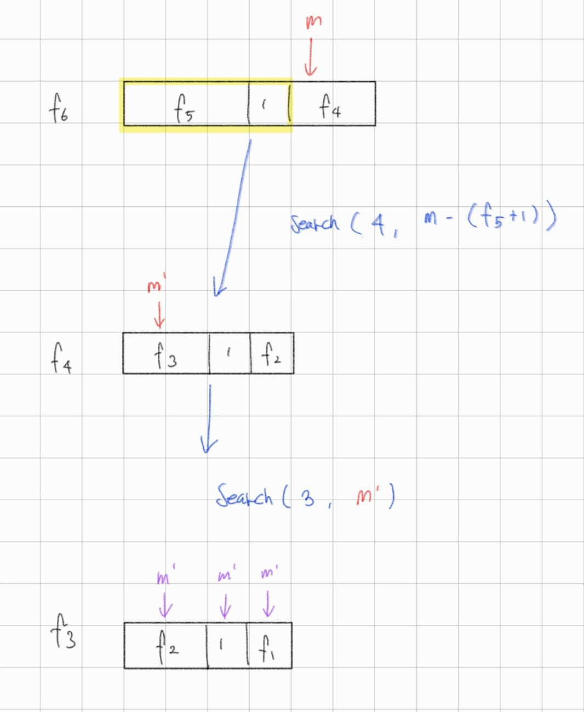
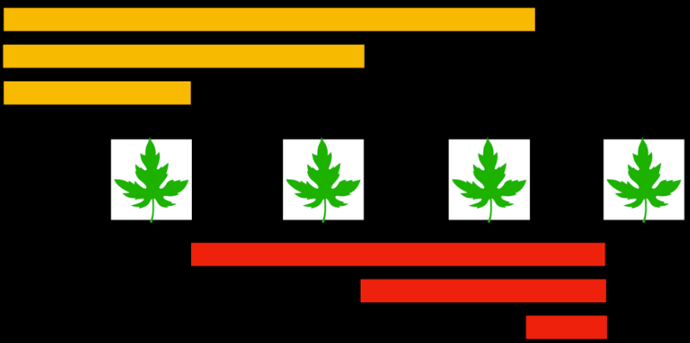

# 8-A 2618

dp 요소를 정하는게 어렵다
### dp 정의
1. 경찰차1가 마지막에 처리하는 사건번호
2. 경찰차2가 마지막에 처리하는 사건번호
```
dp[a][b] = C

경찰차1이 사건 번호 a 처리
경찰차2가 사건 번호 b 처리 
했을 때 움직인 최소 거리 C
```

### 좌표 초기화
* a의 좌표 (0, 0)은 v[0]
* b의 좌표 (n, n)는 v[1]
* w개의 사건들 v[2] ~ v[w + 1]
``` cpp
vector<pair<int,int>> v(1004);
v[0] = {1, 1}; // a의 위치
v[1] = {n, n}; // b의 위치

// 사건 : [2, w+1]에 위치
for(int i = 2; i<= w+1 ; i++){
    cin >> a >> b;
    v[i] = {a,b};
}
```
### 재귀
next 좌표 : 다음 사건 번호 
a와 b가 다음 사건 번호 (next) 로 움직일 때 재귀적으로 동작 
사건번호가 `w+1`일 때 반환값은 0 이어야 return 되면서 값을 더해줄 수 있음.
``` cpp
int go (int aidx, int bidx){
    if(aidx == w + 1 || bidx == w + 1){
        return 0;
    }

    int& ret = dp[aidx][bidx];
    if(ret != -1) return ret;
    ret = 0;

    int next = max(aidx, bidx) + 1;
    
    int aret = go(next, bidx);

    int bret = go(aidx, next);
}
```

### 움직인 거리
최초 a와 b 의 위치는 v[0], v[1]에 위치하므로 `go(0,1)` 로 시작한다.

``` cpp
int val(int prev, int next){
    return abs(v[prev].first - v[next].first) + abs(v[prev].second - v[next].second);
}

int go(int aidx, int bidx){ 

    int& ret = dp[aidx][bidx];
    if(ret != -1) return ret;
    ret = 0;

    int next = max(aidx, bidx) + 1;

    // a로 갈 때
    int aret = go(next, bidx);
    int aval = val(aidx, next);

    // b로 갈 때
    int bret = go(aidx, next);
    int bval = val(bidx, next); 
    
    ret = min(aret + aval, bret + bval);

    return ret;
}

int main(){
    go(0,1);
}
```
### 추적
`dp[i][b] + val(a,i) < dp[a][i] + val(b,i)` 처럼 비교하는 이유는
* i == 2일 때
    1. dp[i][b] + val(a,i) : a가 움직였을 때 `dp[0][1]`의 값
    2. dp[a][i] + val(b,i) : b가 움직였을 때 `dp[0][1]`의 값

두 값중 작은 경우일 때 움직인 것이므로
* 1번 경우일 때, `a = i`로 a가 움직이고
* 2번 경우일 때, `b = i`로 b가 움직인 것이다.

``` cpp
// a, b 시작 위치
int a = 0, b = 1;

// 사건 번호
for(int i = 2; i < w+1; i++){
    
    if(dp[i][b] + val(a,i) < dp[a][i] + val(b,i)){

        // a가 i번 사건 번호로 움직임
        a = i 
    } else{

        // b가 i번 사건 번호로 움직임
        b = i;
    }
}
```

# 8-B 1315
- 퀘스트를 깨는데 순서가 있다고 잘못 생각해 재귀로 접근

평소에 `dfs`, `백트래킹` 처럼 순서대로 재귀를 넘어가는 방식만 생각하고 있는 것 같은데, 이 문제처럼 한번에 확인하는 방법도 생각할 수 있어야 할 것 같다.

## dp 정의
현재 STR, INT 값에서 깰 수 있는 최대 퀘스트

``` cpp
int dp[1004][1004] // 최대 값이 1000을 넘지 않는 
```
## 
- 현재 st, in을 가진 사람이 몇가지 퀘스트를 깰 수 있는지
를 정말로 단순히 현재 값이 조건을 만족하는 경우의 수를 구한다.
``` cpp
// 조건을 만족했으니 
if(st >= av[i].st || in >= av[i].in){
    ret ++;
}
```
이후 현재 단계에서 추가적으로 지나는 점을 체크한다.
``` cpp
if(!visited[i]){
    visited[i] = true;
    pnt += av[i].p;
    vv. push_back(i);
}
```
1. `vv.push_back(i)`
    * 현재 단계에서 `true`로 만들어 준 값들이기 때문에
      다음 단계로 넘어갈 때는 `false`로 만들어 주어야 한다.
      ``` cpp
        for(int a : vv){
            visited[a] = false;
        }
      ```
2. `pnt += av[i].p`
    * 다음 단계는 최댓값 1000을 넘지 않는 선에서 가능한 모든 경우를            
      계산해봐야한다.
      ``` cpp
        for(int i = 0; i<= pnt; i++){
            int next_str = min(1000, st + i);
            int next_int = min(1000, in + (pnt - i));
            ret = max(ret, go(next_str, next_int));
        }
      ```
      * ret에 최댓값으로 최신화하면서 원복해온다. 


# 8-C 17258 ( 버림 )
이 문제에서 건질 내용은 1번 배열을 2번 배열과 같이 유연하게 바꿔서 생각할 수 있다는 점이다.
```
// 1.
0 0 1 1 2 2 3 2 2 1 1 0

// 2.
{2,0}, {2, 1},{5, 2}, {2, 1}

```

``` cpp
int temp = cnt[1];
int count = 1;
for(int i = 2; i<= n; i++){
    if(temp != cnt[i]){
        v.push_back({_count, temp});
        _count = 0;
        temp = cnt[i];
    }
    _count ++;
}
```

# 8-F 1514

## DP
경우의 수 너무 많은 것 같다! → DP????

1. 왼쪽 위치 IDX 
2. a에 더하는 offset 
3. b에 더하는 offset  
4. c에 더하는 offset 
5. 현재 회전하는 방향 
``` cpp
int dp[104][14][14][14][4];
```

#### offset 이 맞나..?
offset이 아직도 어려운데, 다음 idx로 움직일 때  c에 0의 값을 준다.
a의 정답을 구할 때 `in[idx] + a`와 같은 방식으로 값을 주므로 offset으로 생각함


## 경우의 수 
@가 ( 1 ~ 3 )일 때 돌릴 수 있는 방법이 다음 3가지 있기 때문에 총 9가지의 방법으로 돌릴 수 있다.
1. ( + @, 0, 0 )
2. ( + @, + @, 0 )
3. ( + @, + @, + @ )

``` cpp
// 경우의 수 9가지 >> 모두 같은 depth 
for(int i = 1; i <= 3; i++){  
    // a
    ret = min(ret, 1 + go(idx, mod(a + i * _flag) , b, c, flag));

    // a b
    ret = min(ret, 1 + go(idx, mod(a + i * _flag) , mod(b + i * _flag), c, flag));

    // a b c 
    ret = min(ret , 1 + go(idx, mod(a + i * _flag) , mod(b + i * _flag), mod(c + i * _flag), flag));
}
```

## 모듈러 연산 
0 ~ 9까지 수들로 이루어져 있으므로 모든 과정에서 이 범위를 넘어가면 안된다.
``` cpp
int mod(int cur){
    return (cur < 0) ? cur + 10 : cur % 10;
}
```

## 종료 조건 
1. a가 마지막 idx까지 검사 : return 0
2. a가 정답위치에 도달 -> 다음 idx로 넘어감 
    * 시계 방향으로 돌릴 수 있음
    * 반시계 방향으로 돌릴 수 있음 
``` cpp
int go(int idx, int a, int b, int c, int flag){

    // 1. 
    if(idx == n) return 0;

    // 2. 
    if(mod(a + in[idx]) == ans[idx]){
        int f = go(idx + 1, b, c, 0, flag);
        int s = go(idx + 1. b, c, 0, flag );
    }

}
```

# 8-G 17623

## 숫자 string으로 비교
숫자의 자릿수가 너무 크면 string으로 비교를 해야한다.
* int 는 32
* long long 64 

``` cpp
bool check( string fs, string ss){

    // fs가 초기화가 되지않았다는 것이므로 무조건 ss로 교체해야한다.
    if(fs == "") return true;

    // 1. 길이가 같다면 사전순으로 ss가 더 작은 경우 
    if(fs.size() == ss.size()){
        return ss << fs;
    }

    // 2. ss의 자릿수가 더 적은경우 
    return ss.size() < fs.size(); 
}
```

# 8-H 17297
#### 글자를 이어붙이는건 말도 안되는 생각...
m = 2^31 (`10억`)
`10억` 자리 문자열 == `10억` 배열

## 1. 재귀 (분할 정복)


``` cpp
string ret_str = "Messi Gimossi";

int go(int size, int mm){

    if(mm <= v[1]){
        return mm;
    }else if(v[size - 1] + 1 == mm){ // 공백 
        return 0;
    }else if (mm <= v[size - 1]){
        return go(size - 1, mm);
    }else{
       return go(size - 2, mm - (v[size-1] + 1));
    }
}
```

## 2. n의 범위 제한이 없다.
m = 2^31 이란 것만 나와 있을뿐 몇번 시도해야하는지 범위가 정해지지 않았기 때문에 직접 정해야 한다.

길이를 더하는 것으로 횟수를 구한다.
* cnt 변수를 이용하는 방법
* vector 개수를 구하는 방법 
``` cpp
a = 5;
b = 13;
v.push_back(a);
v.push_back(b);

while(c < n){

    c = a + 1 + b;

    a = b;
    b = c;
    v.push_back(c);

}
```
# 8-I 1280
## 동적배열 -> 펜윅트리
비어있는 배열에 나무를 심으면서 계산을 하므로 동적 배열이라 할 수 있다.
- 1번 나무 심고, 계산
- 2번 나무 심고, 계산
- ...
- n번 나무 심고, 계산

``` cpp
vector<ll> tree_cnt(max_n, 0), tree_sum(max_n, 0);

ll _sum(vector<ll> &tree, int value) {
    ll _ret = 0;
    int i = value;
    while (i) {
        _ret += tree[i];
        i -= (i & -i);
    }
    return _ret;
}

void update(vector<ll> &tree, int s_idx, ll value) {

    // update 시작할 idx
    int idx = s_idx;

    while (idx <= max_n) {
        tree[idx] += value;
        idx += (idx & -idx);
    }

    return;
}
```

### 펜윅트리의 모양이 신기하다
이 문제는 `나무 순번`을 idx로 두지 않고 `나무를 심은 위치`를 idx로 잡았다.

``` cpp
ll sum(vector<ll> &tree, int s, int e) {
    if (s > e) return 0;

    // e ~ s 까지의 합
    return (_sum(tree, e) - _sum(tree, s - 1));
}
```

## 이전 나무들의 위치 

cur 번째 심는 나무가 val 위치에 있을때
이전에 심었던 나무들은 좌, 우측에 위치할 수 있다.
- 좌측 : [0, val-1]
- 우측 : [val+1, MAX]

#### 좌 우측 비교
left, right 변수로 나누는 이유
- 좌, 우 각각 나무 개수 분리
- 좌, 우 각각 나무 위치 합 분리 

``` cpp
 // (n-1)*val(n) - sum(n-1)
ll left = sum(tree_cnt, 1, value - 1)*value - sum(tree_sum, 1, value - 1);

// sum(오른쪽) -  (오른쪽 개수) * val(n)
ll right = sum(tree_sum, value + 1, max_n) - sum(tree_cnt, value + 1, max_n) * value ;

ret *= (left + right) % mod;
```

# 8-j 3563

동적 배열 카운팅 : 
## 세그먼트 트리

* pos : 영화의 위치 idx
* arr : 영화가 존재하는 위치를 표시하는 배열 (가상으로 만든 배열)
* tree : arr기반으로 만든 세그먼트 트리

영화를 m번 올리는 것을 배열로 표현하기 위해 `arr[m + n + 1]`이 있다고 가정
* [1, m] : m번 올리는 것 표시하기 위한 idx
* [m+1, n] : 초기 영화 n개
``` cpp
for (int i = 1; i <= n; i++) {
    pos[i] = m + i;

    // [1, m+n]
    update(tree, 1, 1, m + n, pos[i], 1);
}
```

#### sum
구간합 sum을 이용해 `mov` 번호 영화 이전까지의 개수 찾을 수 있다.
arr 함수는 `1` 로 영화가 있다고 표현하므로
구간합 계산을 통해 1의 개수를 구하면 위에 있던 영화의 개수를 구할 수 있다.
``` cpp
// pos[mov]에 있는 영화 위에 있는 영화들의 개수를 구할 수 있음 
sum(tree, 1, 1, m + n, 1, pos[mov] - 1)
```

#### pos[mov] 위치의 영화를 위로 올릴때
* pos[mov] = 0 
* pos[mov] = k (1 <= k <= m)

arr을 이용해서 위치를 최신화시키는 것을 update를 이용해서 tree에 한번에 적용시킨다.
``` cpp
for (int k = m; k >= 1; i--) {
    // pos[mov] = 0;
    update(tree, 1, 1, m + n, pos[mov], -1);  

    // pos[mov] = k
    update(tree, 1, 1, m+n, k, 1);
}
```


##
동적 배열 counting -> `펜윅트리`

# 8-K 2042
## 펜윅 트리

펜윅트리의 update는 `tree[idx] += val`처럼 더하기만 가능하다.
`tree[idx] = val` 과 같이 대입하는 형태는 불가능
``` cpp
void update(int idx, ll val){
    while(idx <= n){
        tree[idx] += val;
        idx += (idx & -idx);
    }
}

덧셈만 가능하기 때문에 차이(diff)를 넘겨주어야 한다.
``` cpp
ll diff = c - arr[b];
arr[b] = c;
update(b,diff);

```

## 세그먼트 트리 

누적합 : 정적배열
트리 : 동적배열

# 8-M 1486

## 1. 플로이드 워셜  (모든 쌍 알고리즘 )

### 최단 거리 알고리즘
1. 다른 점으로 갈 때마다 가중치가 다르다. 
2. D이하로 갈 때, 최대 높이 -> `D이하`로 가니 `최단거리`
3. D 시간 이내에 `(0,0) -> (N,M) -> (0,0)` 와 같이 원점으로 돌아와야 하니 `모든 쌍` 정보에 대해서 알아야 한다.

모든 쌍에 대해 거리를 알아야 하므로 `플로이드 워셜`로 풀 수 있다.

### 2차원 배열 -> 1차원 
2차원 [r][c] 점을 `r*100 + c` 와 같이 1차원으로 표현할 수 있다.
``` cpp
for(int i = 0; i<n; i++){
    for(int j = 0; j<m; j++){ 
        v.push_back(i * 100 + j);  // 1차원 으로 
    }
}
```

2차원점 2개로 이동을 표현하려고 할 때 표현이 어렵다.
위치를 1차원으로 표현하면 더 쉽다.
``` cpp
b[i*100 + j][ny*100 + nx]
```

### 플로이드 워셜 
b[i][j] : i -> j로 가는 최단거리 

```cpp
for(int k : v){
    for(int i : v){
        for(int j : v){
            b[i][j] = min(b[i][j], b[i][k] + b[k][j]);
        }
    }
}
```

최댓값은 `b[0][dest] + b[dest][0]` 값으로 max 값을 구할 수 있다.


# 좌표압축 18870 
입력으로 받은 좌표의 값들을 작은 범위의 정수로 압축

입력으로 받은 좌표값들을 정렬해서 작은 값부터 차례대로 번호를 매기는 것
값 번호 → 정렬된 배열에서의 `인덱스`

## 중복 제거
``` cpp
vector<int> pv;
sort(pv.begin(), pv.end());
pv.erase(unique(pv.begin(), pv.end(), pv.end());

//1000 999 1000 999 1000 999
// 999 1000
```

## 이분탐색
v[i] 를 pv에서 몇번째 위치하는지 찾아야 하므로 시간복잡도가 `O(n^2)`
이를 `O(nlogn)`으로 바꾸기 위해서 이분탐색을 사용한다.

## map 쓰는 방법
map은 key를 정렬한다.
여기서 map의 value에는 key가 몇번째 수인지 나타내는 값이다.
``` cpp
// 초기화
m.insert({p,0});

int cnt = 0;
for(auto & m : mp){
    m.second = cnt++;
}
```

# 8-O 16118
## 실수
이 문제 토글형 문제이므로 홀수일때 `/2` 하면 정확하지 않은 수가 된다.
정확한값을 구하는 것이 아니므로 처음에 가중치 2를 더한 상태여도 된다.
``` cpp
adj[a].push_back({b,d*2});
adj[b].push_back({a,d*2});
```
## 우선순위큐

#### 1. 비교 struct [operator()]
``` cpp
struct ww{
    int cost, pos, tog;
};

struct compare{
    bool operator()(ww a, ww b){
        return a.cost > b.cost;
    }
};

priority_queue<ww, vector<ww>, compare> pq; 
```

#### 2. operator<
``` cpp
struct ww{
    int cost, pos, tog;

    bool operator<(const ww& w) const {
        return this->cost > w.cost;
    }
};

priority_queue<ww> pq; 
```

## 느긋한 삭제
가장 짧은 정점만을 처리하는 것을 말하며 
그 외의 불필요한 정점을 바로바로 삭제 하지 않고 
나중에 다음과 같이 continue를 통해 거르는 것

최솟값 구하는 것 
#### 1차원
``` cpp
 if (dist[u] != here_cost) continue;
 if (dist[u] < here_cost) continue;
```
#### 2차원 
``` cpp
if(dist_wolf[here][tog] < here_cost) continue;
```

# 8-1219
## 벨만 포드
다익스트라와 다르게 `음의 가중치`가 있을 때 사용
`방문으로 얻을 수 있는 값 - 교통비` 가 음수가 될 수 있으니 벨만포드를 사용해야 한다.


``` cpp
queue<int> q;

for (int i = 0; i < n; i++) { // 1. 

    for (int here = 0; here < n; here++) {
        for (auto it : adj[here]) {
            int d = it.second;
            int next = it.first;

            // 지날 수 있는 점 + 최댓값
            if (dist[here] != -INF && dist[here] - d + val[next] > dist[next]) {
                dist[next] = dist[here] - d + val[next];

                if (i == n - 1) { // 사이클을 발견한 경우
                    q.push(next);
                }

            }
        }
    }
}

```
#### 정점이 n개 이므로 `n-1번`,  `모든 정점`을 탐색한다.
마지막 `n-1`은 음의 순환이 발생하는지 확인하는 용도이다. 


``` cpp
if (dist[epos] == -INF) { // 1. 도달하지 못했을 때
    puts("gg");
} else if (ok) {          // 2. 완화 -> 순환이 발생했을 때
    puts("Gee");
} else {                  // 3. 정상
    cout << dist[epos] << '\n';
}
```
1. n-1 탐색을 진행하면서도 epos에 도달하지 못했을 때
2. q는 `최댓값으로 완화`로 진행하면서 순환이 발생하는 곳을 보관한다.
    * 순환 경로를 탐색하면서 `epos`를 지난다면 돈이 계속 증가한다.

# 8-Q 1613

## 시간 복잡도
#### 플루이드-워셜
* n < 400 일 때, 시간복잡도 `O(n^3)`

#### BFS
* 기본적인 BFS의 시간복잡도 `O(V + E)`
    * V : 정점
    * E : 간선 
* 모든 정점에 대해서 BFS를 해야한다면 `O(V * (V + E))`

## 플루이드-워셜 = K I J !!
K가 중간 정점으로 !!!
``` cpp
for(int k = 1; k <= n; k++){
    for(int i = 1; i <= n; i++){
        for(int j = 1; j <= n; j++){
            if(dist[i][k] == 1 && dist[k][j]==1) {
                dist[i][k] = 1;
            }else if (dist[i][k] == -1 && dist[k][j] == -1){
                dist[i][j] = -1;
            }
        }
    }
}
```

# 8-R 1238
* 모든 쌍을 구하는 플로이드 워셜을 생각해야하지만, n이 400 이하일 때만 사용할 수 있으므로 불가능 
* 다익스트라  

## 다익스트라 
1. a, b, c, d 가 x로 가는 것 
2. x에서 a, b, c, d로 되돌아가는 것 

2번은 x를 시작점으로 하는 다익스트라를 통해서 `dist[a]`, `dist[b]` .. 를 구할 수 있다.

기존의 간선 상태를 이용해서 이런 경우들이 생김 
* 시작점 a 다익스트라 → `dist[x]`
* 시작점 b 다익스트라 → `dist[x]`
* 시작점 c 다익스트라 → `dist[x]` 

하지만 이 방법은 `x`만 구하는 것이 아닌 모든 다익스트라 경우를 실행한 이후 x점만 구하는 것이다.

### 간선 반대 방향 
기존의 간선을 반대방향으로 저장하면, x를 시작점으로 하는 다익스트라의 dist가
* a → x
* b → x
* c → x 
로 가는 방식을 의미하게 된다. 

``` cpp
for(int i = 0; i < M; i++){
    scanf("%d %d %d", &u, &v, &w);
    adj[u].push_back(make_pair(w, v));  // 2. x -> a,b,c,d,e 로 가는 방식
    adj2[v].push_back(make_pair(w, u)); 
}

dijkstra(dist, adj); 
dijkstra(dist2, adj2);

for(int i = 1; i <= N; i++){
    ret = max(ret, dist[i] + dist2[i]); 
}  
```

